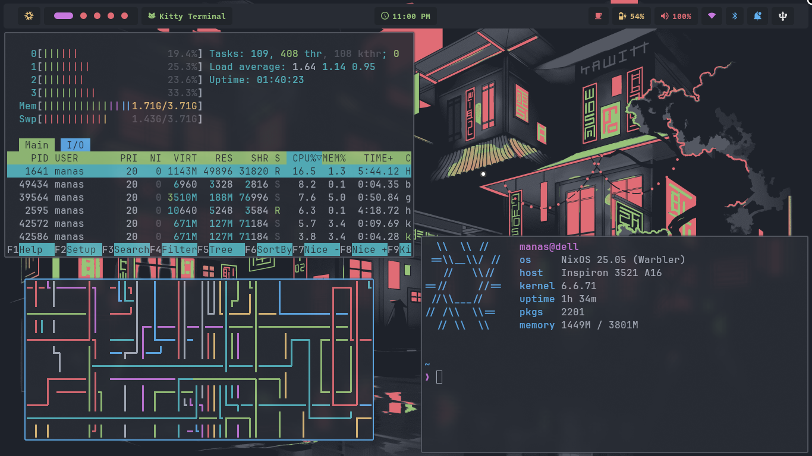
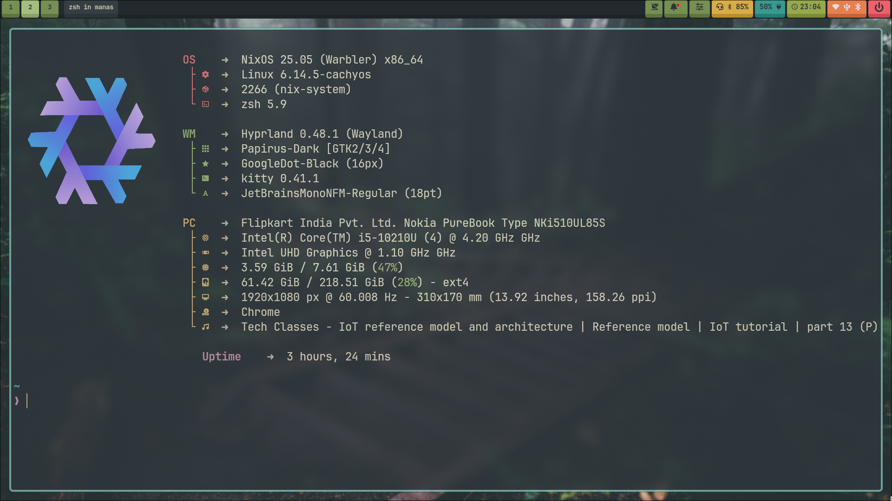
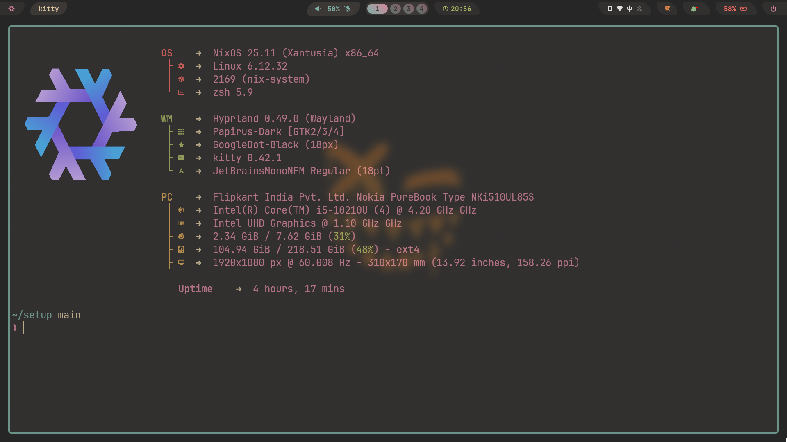

# ❄️ My NixOS Config

> ⚠️ **Note:** Hyprland is the only fully configured desktop environment. If you
> want to use a different DE/WM, you’ll need to set it up manually.

---

## 🚀 Installation Steps

### 1️⃣ Install NixOS (Without Any Desktop Environment)

Once you're in your NixOS terminal, run the following to install essential
tools:

```bash
nix-shell -p git vim
#Optionally: install htop and tmux for monitoring CPU/RAM usage
```

---

### 2️⃣ Clone This Repository

```bash
git clone https://github.com/manas-katual/nixos-config ~/setup 
cd ~/setup
```

> 📌 **Important:** Stay inside this folder throughout the rest of the
> installation.

---

### 3️⃣ Create a Host Folder for Your Machine

```bash
cp -r hosts/nokia hosts/<your-desired-hostname>
# Replace <your-desired-hostname> with the hostname of your choice
```

---

### 4️⃣ Add Your Host

Edit `hosts/default.nix`:

- Copy an existing entry (like `dell`, `nokia`, etc.)
- Modify the `hostName` and `mainMonitor` as needed

Then edit `flake.nix` and update:

- Your **username**
- Your **GitHub username**
- Your **Git email address**

---

### 5️⃣Generate Hardware Configuration

```bash
nixos-generate-config --show-hardware-config >
hosts/<your-desired-hostname>/hardware-configuration.nix
```

---

### 6️⃣ Enable Flakes and Build the System

Run the following command, replacing `hostname` with your chosen hostname:

```bash
NIX_CONFIG="experimental-features = nix-command flakes"
sudo nixos-rebuild switch --flake .#hostname
```

---

### 7️⃣ Reboot and Use the Alias to Rebuild (Optional)

After rebooting, you can use the provided alias for quick rebuilds:

```bash
fucking-flake-rebuild
# OR
cd ~/setup sudo nixos-rebuild switch --flake .
```

---

## 🎉 Done! Enjoy Your System

### Hyprland with Hyprpanel



### Hyprland with Waybar

\


---

## ✅ To-Do

- 🔄 Make this configuration more universal and user-friendly
- 🖥️ Add support for other desktop environments/window managers
