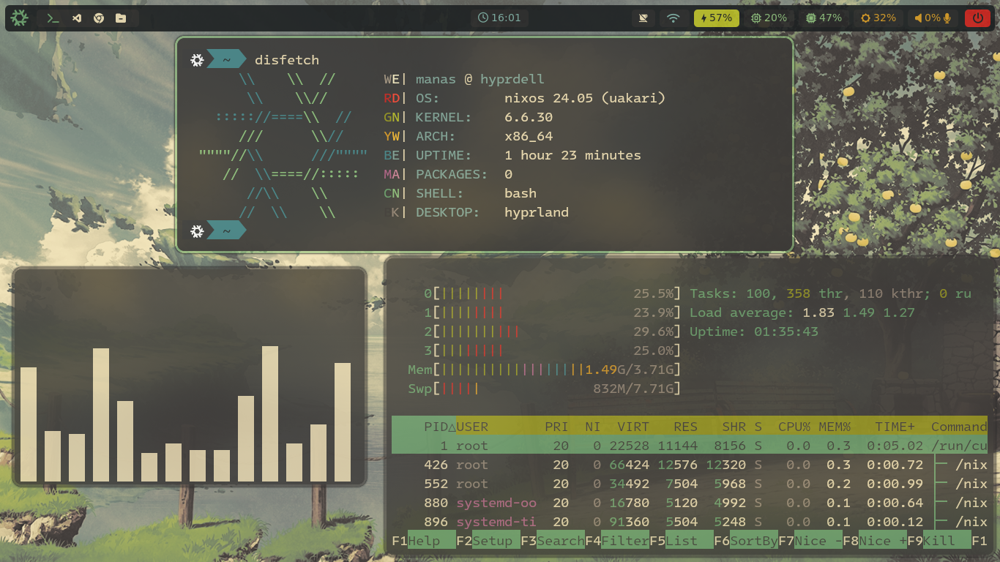

# ❄️ My NixOS Config

## steps for installing 

Run this command to ensure Git & Vim are installed:

```bash
nix-shell -p git vim
```

Clone this repo & enter it:

```bash
git clone https://github.com/manas-katual/nixos-config ~/setup
cd setup
```
- must stay in this folder for the rest of the install

Create the host folder for your machine

```bash
cp -r hosts/default hosts/<your-desired-hostname>
```

Generate hardware.nix like so:

```bash
nixos-generate-config --show-hardware-config > hosts/<your-desired-hostname>/hardware-configuration.nix
```

Run this to enable flakes and install the flake replacing hostname with whatever you put as the hostname:

```bash
NIX_CONFIG="experimental-features = nix-command flakes" 
sudo nixos-rebuild switch --flake .#hostname
```

OR

change host in the flake.nix file

```bash
host = "<desired-hostname>";
sudo nixos-rebuild switch --flake .
```

Enjoy!


