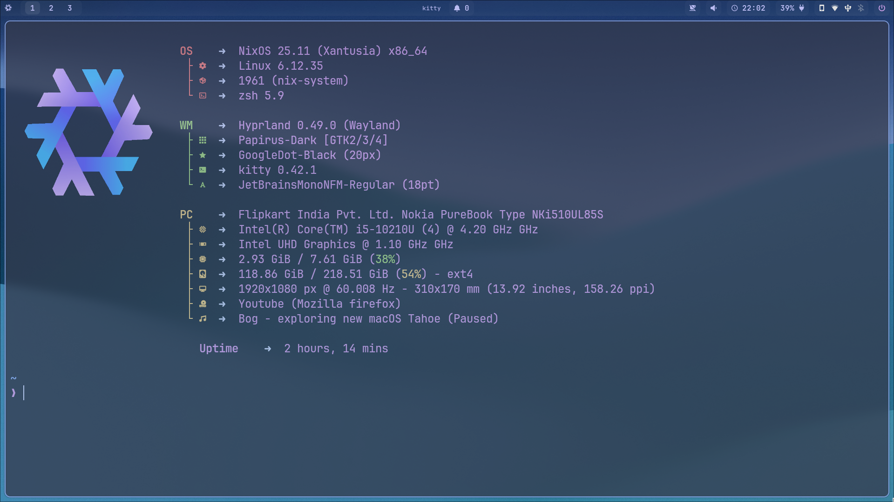

<div align="center">

# ❄️ My NixOS Config

### Hyprland + waybar



### Hyprland with Waybar + Eww


### Hyprland with Waybar


### Hyprland with Hyprpanel


</div>

## ⚠️ Note:

> Hyprland is the only fully configured desktop environment. If you want to use
> a different DE/WM, you’ll need to set it up manually.

## 🚀 Installation Steps

### 1️⃣ Install NixOS (Without Any Desktop Environment)

Once you're in your NixOS terminal, run the following to install essential
tools:

```bash
nix-shell -p git vim
#Optionally: install htop and tmux for monitoring CPU/RAM usage
```

### 2️⃣ Clone This Repository

```bash
git clone https://github.com/manas-katual/nixos-config ~/setup 
cd ~/setup
```

> 📌 **Important:** Stay inside this folder throughout the rest of the
> installation.

### 3️⃣ Create a Host Folder for Your Machine

```bash
cp -r hosts/nokia hosts/<your-desired-hostname>
# Replace <your-desired-hostname> with the hostname of your choice
```

### 4️⃣ Add Your Host

Edit `hosts/default.nix`:

- Copy an existing entry (like `dell`, `nokia`, etc.)
- Modify the `hostName` and `mainMonitor` as needed

Then edit `flake.nix` and update:

- Your **username**
- Your **GitHub username**
- Your **Git email address**

### 5️⃣ Generate Hardware Configuration

```bash
nixos-generate-config --show-hardware-config > hosts/<your-desired-hostname>/hardware-configuration.nix
```

### 6️⃣ Enable Flakes and Build the System

Run the following command, replacing `hostname` with your chosen hostname:

```bash
NIX_CONFIG="experimental-features = nix-command flakes"
sudo nixos-rebuild switch --flake .#hostname
```

### 7️⃣ Reboot and Use the Alias to Rebuild (Optional)

After rebooting, you can use the provided alias for quick rebuilds:

```bash
fucking-flake-rebuild
# OR
cd ~/setup 
sudo nixos-rebuild switch --flake .
```

## ✅ To-Do

- 🔄 Make this configuration more universal and user-friendly
- 🖥️ Add support for other desktop environments/window managers

## Reference

- Tyler Kelley https://gitlab.com/Zaney
- Matthias Benaets https://github.com/MatthiasBenaets
- Jackson Novak https://gitlab.com/Oglo12

## 🎉 Done! Enjoy Your System
